# Caster

**Script-like readability, native-like power.**

Caster is a small experimental compiled language for writing code that feels
direct like a script, while still compiling to plain C. Function boundaries are
explicitly typed, local variables are inferred, values copy by default, and
caller-visible mutation is marked with `REF` plus the `*` mutation operator.

Full documentation: https://dlanoff.github.io/caster-lang/

The practical goal is simple: write services, data transformations, and systems
scripts with much less ceremony than C, without giving up a clear runtime
model.

## Quick Start

Install the runner once, then run a Caster file directly:

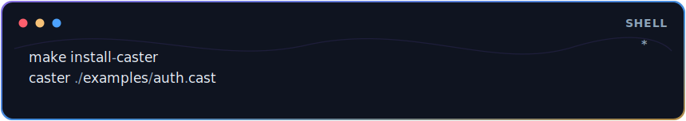

Caster writes generated C and binaries to one hidden `.caster/` folder at the
current run root. A subfolder source such as `examples/webapp.cast` becomes an
artifact like `.caster/examples__webapp.C`.

The full local suite is:

```sh
make -f build/Makefile test
```

## WEB Example

Caster WEB is the built-in web framework for writing HTTP servers in Caster.
It provides route helpers, request and response types, and JSON/text response
helpers without leaving the language. In route-heavy files, `main()` can live at
the top for readability; the compiler emits it after helper functions in
generated C. This example registers an authenticated route and uses
`.filt(...).agg(...)` for a small payment calculation inside the handler.

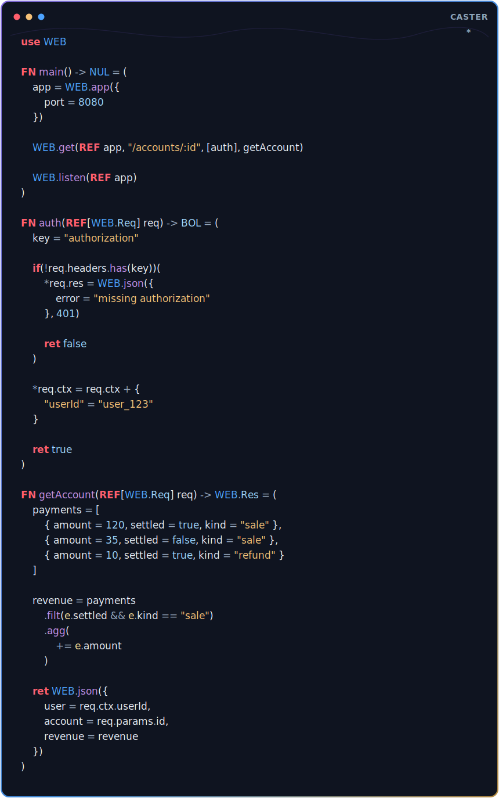

`use WEB` imports route helpers and the visible request/response types
`WEB.Req` and `WEB.Res`. `WEB.json(value, status)` accepts an optional status
code;

## WEB Benchmark Snapshot

Early local benchmark snapshot, same mixed GET/POST workload and same `wrk`
settings: 4 threads, 128 connections, 30 seconds, localhost.

| Runtime              |     Throughput | Avg latency |    Total requests | Non-2xx |
| -------------------- | -------------: | ----------: | ----------------: | ------: |
| Caster WEB           | ~9,707 req/sec |    14.95 ms | 291,379 in 30.02s |   2,912 |
| Go `net/http` router | ~8,267 req/sec |    15.47 ms | 248,137 in 30.01s |   2,480 |

In that run, Caster WEB on the H2O-backed runtime was roughly 17% higher
throughput than the single-threaded Go generic-router mirror. Treat this as a
local snapshot, not a production claim: no TLS, external network, database I/O,
multi-process tuning, or soak testing is included.

## Functions And Locals

Function signatures are the typed edge of the language. Inside function bodies,
ordinary local variables infer. A new local initialized directly from a
user-written function call declares the returned type so call boundaries remain
visible.

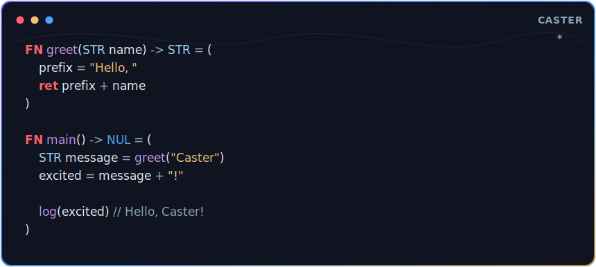

Return types give context to returned literals, so shaped `MAP` and `ARR`
values can stay terse inside function bodies.

## MAP

`MAP` is one language concept with two lowerings. If the key set is stable, the
compiler can lower it like a C struct. If runtime keys are used, it lowers to a
hashmap/open object shape. Source stays unified.

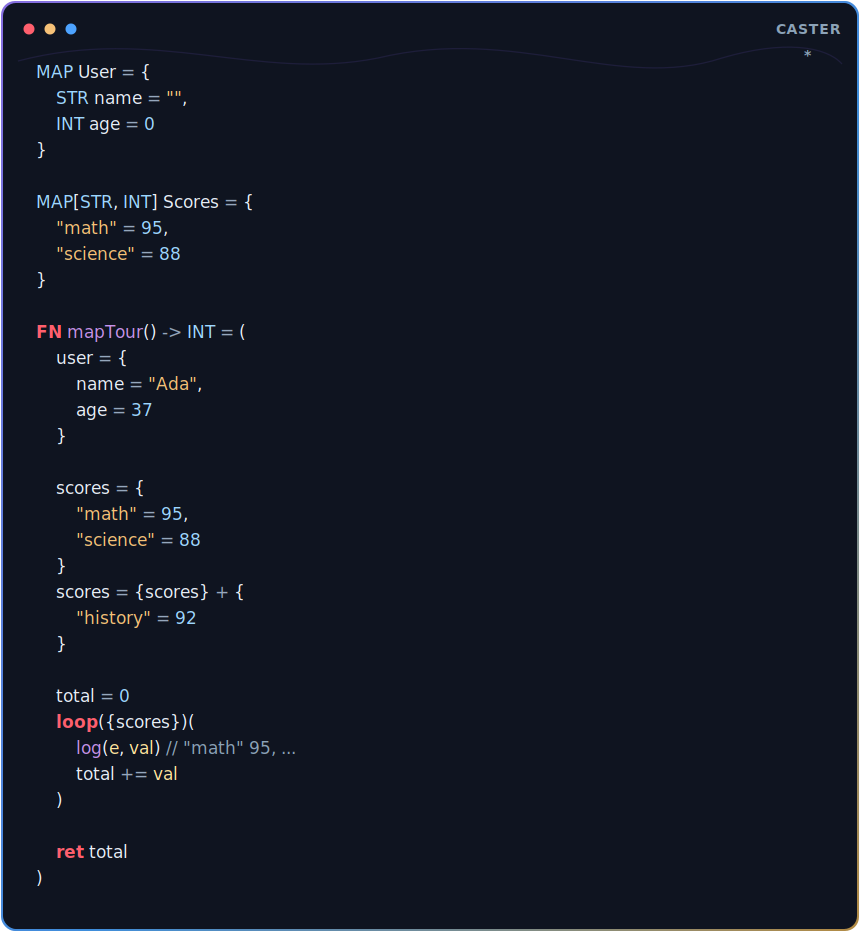

Canonical MAP operations:

- Fixed MAP updates use `.upd({...})`.
- Dynamic/open MAP joins use `{left} + {right}`.
- Map loops use `e` for the key and `val` for the value.

## ARR

Arrays use `ARR[T]` in type positions and bracket literals in value positions.
`.add(value)` appends one item, `.add([values])` extends, and `array + array`
concatenates. Prefix a method statement with `*` when mutation should happen in
place.

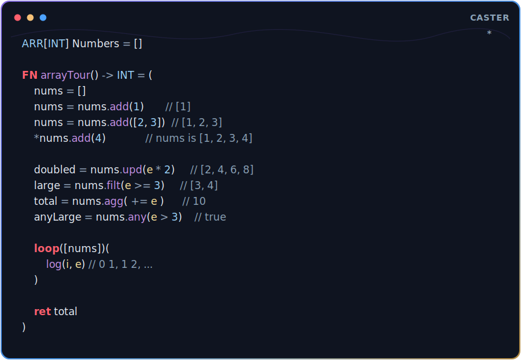

Collection methods are expression-oriented by default:

- `.upd(...)` maps values.
- `.filt(...)` keeps matching values.
- `.agg(...)` accumulates with `+=` and `-` body steps.
- `.any(...)` returns `BOL`.
- `.group(...)`, `.sort(...)`, and `.ARR()` support report-style pipelines.

## Loops

Loops infer common variables you use most:

- Count loops expose `i`.
- Range loops expose `e`.
- Array loops expose `i` and `e`.
- Map loops expose `e` and `val`.

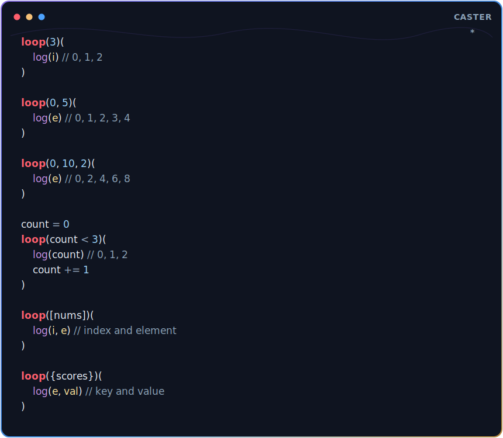

The canonical style is to use `e` directly in a single loop. Avoid copying it
into throwaway names unless a real domain name improves the code.

## Nested Loops

A loop source is evaluated before the new loop’s `e` and `i` bindings are
introduced. That lets the inner source use the outer `e`, while the original
outer collection still provides `collection.e` and `collection.i`.

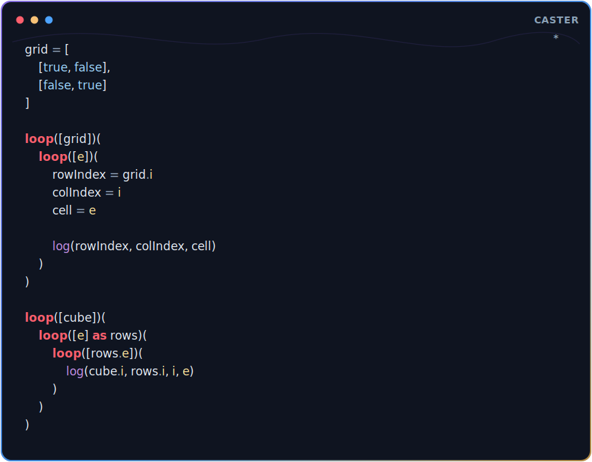

Use `as` only when a middle frame must survive into a third loop.

## Collection Pipelines

Pipelines are meant to read as data flow. Methods chain, but `ret` is not used
inside method bodies; method bodies should stay expression-oriented.

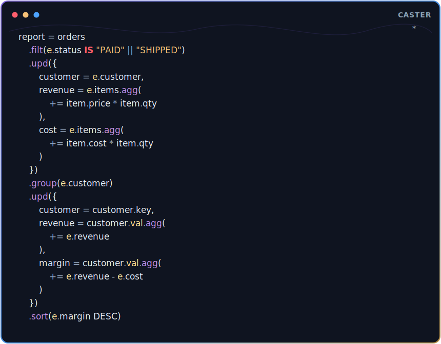

`IS` establishes a repeated comparison subject:

```cast
status IS "PAID" || "SHIPPED"
code IS >= 200 && < 300
```

Bare clauses imply equality, while explicit comparison operators remain
available.

## JSON And DYN

`JSON(str)` returns `DYN`. Dot access on `DYN` returns `DYN`, and `else`
extracts/coerces to the fallback type. Decode at the boundary, then keep the
rest of the program typed.

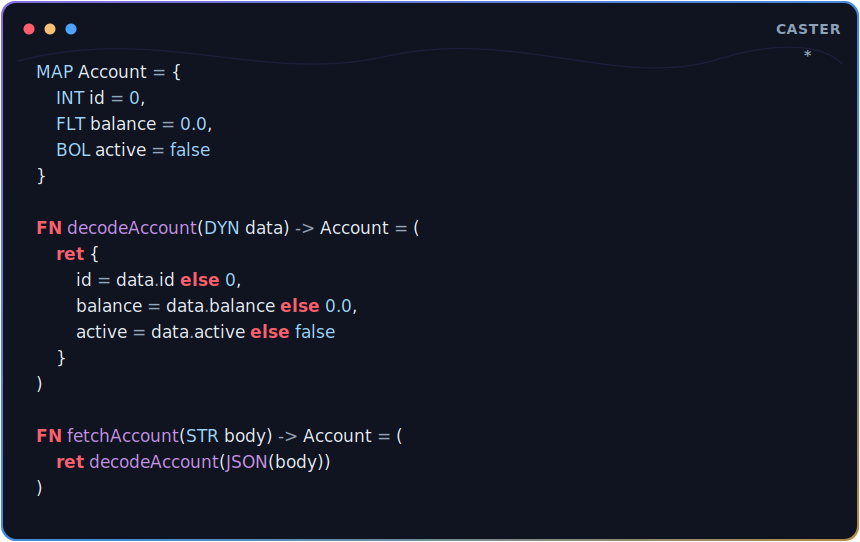

## Dot Access

Dot access is used for fixed fields, array indexes, dynamic keys, and DYN
traversal. Simple steps use `.name` or `.0`; computed steps use
`.[expression]`.

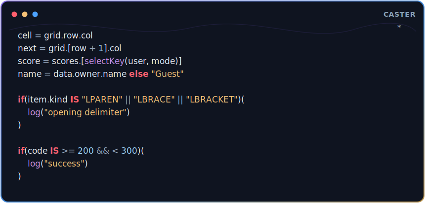

Examples:

```cast
foo.bar.i.0        // simple access steps
foo.[bar.i].0      // evaluate bar.i as the access step
foo.[i + 1].name   // computed index
```

## REF And Mutation

`REF[T]` is the visible reference type in function signatures and MAP fields.
`REF value` borrows an existing value. The `*` mutation operator marks
caller-visible mutation through a reference.

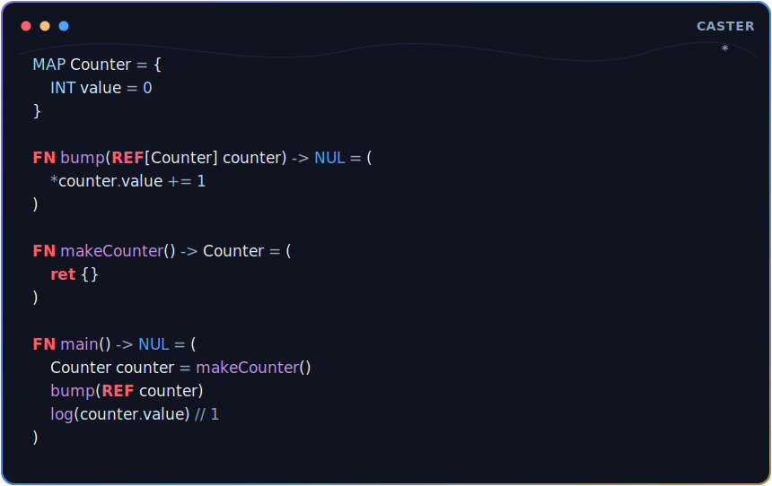

Normal assignment remains value-oriented. A function-local borrow cannot be
returned or stored somewhere that may outlive the value it references.

## Current Surface

Caster currently includes:

- Typed functions, imports, local inference, nested helpers, and `main()` anti-hoisting.
- Fixed and dynamic MAPs, arrays, strings, raw strings, JSON/DYN, and dot access.
- Collection methods: `.add`, `.upd`, `.filt`, `.agg`, `.any`, `.group`, `.sort`, `.ARR`, `.STR`.
- `REF` mutation, owned-local cleanup, and request cleanup boundaries for WEB.
- Native adapters for `WEB`, `REQ`, `SQL`, `OS`, `FS`, `PATH`, `IO`, `PROC`, and `BUF`.
- `caster check --json file.cast` diagnostics for editor integration.
- A production C compiler in `src/caster` and an in-progress self-hosted compiler mirror in `self_hosting`.

## Repository

- `src/caster/`: current production compiler and emitter in C.
- `self_hosting/`: Caster implementation of the compiler/transpiler shape.
- `tests/`: compiler/runtime coverage.
- `examples/`: runnable Caster programs.
- `docs/`: GitHub Pages documentation site and README SVG assets.
- `vendor/`: vendored third-party source with preserved licenses.

## License

Caster is MIT licensed.

Third-party libraries under `vendor/` retain their original licenses and
notices. See `THIRD_PARTY_NOTICES.md` for details.

## Notes

This project was developed with AI assistance.
